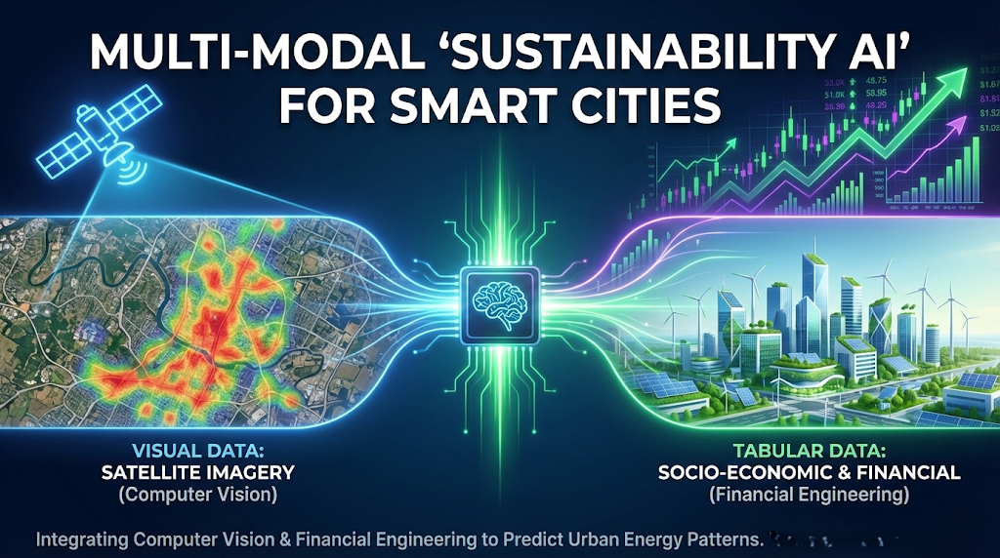

<div align="center">
  <a href="Technical Report.pdf">
    
  </a>
  <p><em>Click the banner to view the full analysis report</em></p>
</div>

# 🌍 Multi-Modal "Sustainability AI" for Smart Cities


### 📊 Executive Summary
This project leverages **Multi-Modal Deep Learning** to predict urban energy consumption patterns. By fusing **Sentinel-2 Satellite Imagery** (Computer Vision) with **Financial & Census Data** (Tabular ML), the model achieves an **$R^2$ of 0.75**, offering a scalable tool for urban planners to identify energy hotspots without invasive monitoring.

---

### 🧠 The Solution: Hybrid AI Architecture
We treat the city as a living organism that must be analyzed visually and economically.
* **The "Eyes" (CNN):** A ResNet-18 Neural Network processes satellite images to detect concrete vs. green space.
* **The "Context" (MLP):** A tabular network analyzes Median Income, Population Density, and **Energy Market Volatility (XLU ETF)**.
* **The Result:** A fused prediction of Energy Consumption (kWh).

### 🚀 Key Results
| Metric | Result | Description |
| :--- | :--- | :--- |
| **R² Score** | **0.7527** | High correlation between predicted and actual energy use. |
| **Training Loss** | **0.015** | Converged smoothly over 50 epochs. |
| **Key Insight** | **Market Volatility** | Financial indicators proved to be a top-3 predictor of consumption. |

### 🖼️ Visuals
**1. Model Performance (Actual vs Predicted)**


**2. Explainability (Saliency Map)**
*The model "looking" at buildings (red/hotspots) to determine energy demand.*


---

### 🛠️ Tech Stack
* **Data Acquisition:** Google Earth Engine API, Yahoo Finance (yfinance).
* **Deep Learning:** PyTorch, Torchvision (ResNet-18).
* **Explainability:** SHAP, Saliency Maps.
* **Data Science:** Pandas, NumPy, Scikit-Learn.

### 📂 Repository Structure
```bash
├── data/               # Raw and processed datasets
├── notebooks/          # Jupyter Notebooks (EDA, Modeling, XAI)
├── src/                # Modular Python scripts
├── models/             # Saved PyTorch model weights (.pth)
├── reports/            # Generated figures and Final Report
└── requirements.txt    # Dependencies
```
💻 How to Run
1. Clone the repo:
``` bash
git clone https://github.com/Sanaurrehmanarain/sustainability-ai-smart-cities.git
```
2. Install dependencies:
``` bash
pip install -r requirements.txt
```
1. Run the modeling notebook:
``` bash
jupyter notebook notebooks/03_modeling.ipynb
```
## Citation

If you use this project in academic research, publications, educational
materials, or derivative works, please cite the project.

This repository includes a `CITATION.cff` file, so GitHub provides a
**"Cite this repository"** button in the repository sidebar. You can use it
to obtain citations in BibTeX, APA, and other supported formats.

**Suggested citation:**

Arain, S. U. R. (2026). sustainability-ai-smart-cities (Version 1.0) [Software].
<https://github.com/sanaurrehmanarain/sustainability-ai-smart-cities>

**Author:** Sana Ur Rehman Arain

**Profession:** Data Scientist

**GitHub:** <https://github.com/sanaurrehmanarain>

**Contact:** <sana.arain.work@gmail.com>

If you build upon this work, attribution is appreciated and helps others
discover the original project.

> **Note:** The MIT License requires that the original copyright
> notice be retained in copies of the Software.

---

## License

This project is licensed under the MIT License. See the
[LICENSE](LICENSE) file for details.
